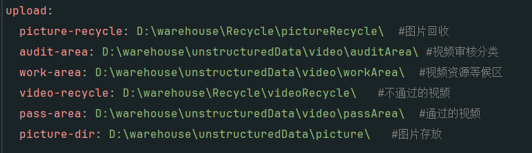

# 视频管理

简介

这是一个本地视频管理软件,将大量视频作分类以及更有效得存储;当然也可发布到网上,里面也有简单得单点登录和多租户系统;

预览

# 如何使用

### 你需要准备以下文件目录树

- warehouse
    - Recycle
        - pictureRecycle
        - videoRecycle
    - unstructuredData
        - picture
            - avatar
              - default.png
            - cover
            - mirror
            - teacher
        - video
            - auditArea
            - passArea
            - workArea

### 与配置文件相适应

### sql脚本再后端代码中

### 使用root用户登录(account:root,password:123456)

把所有需要被管理的视频放入workArea文件夹下,在管理页面右上角点击导入

在视频审核之前添加艺术家信息是必要的它根据次决定已通过视频最终存储位置,而后我们可以为此视频控制状态(待审核,待发布,疑似重复,已废弃,已发布),也可以添加艺术家信息,以及贴标签

